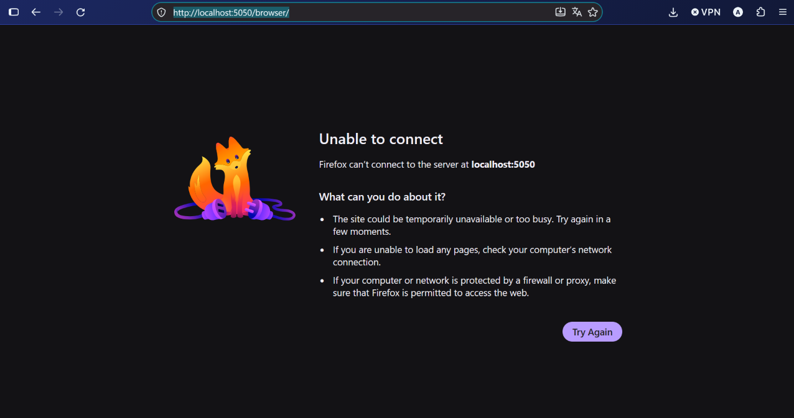

# Questionnaire de présentation du projet MediCare

## 1. Présentation générale

### Quel est le nom du projet ?

Le projet s'appelle **MediCare**. Il s'agit d'une application desktop de gestion hospitalière.

### Quel est l'objectif de l'application ?

L'application permet de gérer les principales informations d'un établissement hospitalier :

- les médecins ;
- les patients ;
- les médicaments ;
- les consultations ;
- les médicaments prescrits ;
- les comptes utilisateurs et l'authentification.

L'objectif est de centraliser les données et de proposer une interface graphique permettant d'ajouter, consulter, modifier et supprimer les informations.

### Quelles technologies sont utilisées ?

Le projet utilise :

- **C++** comme langage de programmation ;
- **Qt 6 Widgets** pour l'interface graphique ;
- **Qt SQL** pour l'accès à la base de données ;
- **MySQL** comme système de gestion de base de données ;
- **CMake** pour la configuration et la compilation ;
- **QSS** pour la personnalisation graphique de l'application.

La configuration se trouve dans [CMakeLists.txt](CMakeLists.txt).

---

## 2. Déroulement de l'application

Le point d'entrée se trouve dans [main.cpp](main.cpp).

Au démarrage, l'application suit les étapes suivantes :

1. Création de l'objet `QApplication`.
2. Chargement du fichier `style.qss` depuis les ressources Qt.
3. Création et configuration de la connexion MySQL.
4. Ouverture de la base de données.
5. Affichage du formulaire de connexion.
6. Fermeture de l'application si l'authentification échoue.
7. Affichage de `MainWindow` si l'utilisateur est authentifié.
8. Lancement de la boucle événementielle avec `app.exec()`.

```cpp
QApplication app(argc, argv);
```

### Quel est le rôle de `QApplication` ?

`QApplication` initialise l'application Qt Widgets. Il gère notamment :

- les événements de la souris et du clavier ;
- les fenêtres ;
- les événements graphiques ;
- le système de styles ;
- la boucle événementielle.

### Pourquoi utiliser `app.exec()` ?

`app.exec()` démarre la boucle événementielle Qt. Cette boucle permet à l'application de rester active et de traiter les clics, les frappes clavier, les changements de fenêtres et les autres événements.

Sans cette instruction, la fenêtre pourrait se fermer immédiatement après sa création.

---

## 3. Connexion à la base de données

La connexion MySQL est créée dans [main.cpp](main.cpp) avec le pilote `QMYSQL` :

```cpp
QSqlDatabase db =
    QSqlDatabase::addDatabase("QMYSQL", "hospital_connection");

db.setHostName("localhost");
db.setPort(3306);
db.setDatabaseName("hopital");
db.setUserName("root");
db.setPassword("");
```

### Pourquoi donner un nom à la connexion ?

La connexion reçoit le nom `hospital_connection`. Les autres classes peuvent ensuite récupérer exactement cette connexion :

```cpp
QSqlDatabase db =
    QSqlDatabase::database("hospital_connection");
```

Cela évite de recréer une connexion dans chaque formulaire.

### Quel est le rôle de `QSqlDatabase` ?

`QSqlDatabase` représente une connexion entre l'application Qt et un système de gestion de base de données, ici MySQL.

Il permet de :

- configurer le pilote ;
- définir l'hôte et le port ;
- choisir la base de données ;
- ouvrir ou fermer la connexion ;
- consulter les erreurs de connexion.

### Quel est le rôle de `QSqlQuery` ?

`QSqlQuery` permet d'exécuter des requêtes SQL depuis le programme C++ :

```cpp
QSqlQuery query(db);
query.prepare("SELECT Matricule, Nom FROM Medecin");
query.exec();
```

### Pourquoi utiliser `prepare()` et `bindValue()` ?

Ces méthodes permettent d'utiliser des requêtes paramétrées :

```cpp
query.prepare(
    "SELECT COUNT(*) FROM utilisateur "
    "WHERE login = :login AND mot_de_passe = :motDePasse"
);

query.bindValue(":login", login);
query.bindValue(":motDePasse", hash);
```

C'est plus sûr que de concaténer directement les valeurs saisies par l'utilisateur dans la chaîne SQL. Cette technique réduit notamment le risque d'injection SQL.

---

## 4. Architecture générale

La fenêtre principale est définie dans [MainWindow.h](MainWindow.h) et [MainWindow.cpp](MainWindow.cpp).

Elle utilise un `QStackedWidget` pour gérer les différentes pages de l'application.

Les pages principales sont :

- la page d'accueil ;
- la gestion des médecins ;
- la gestion des médicaments ;
- la gestion des patients ;
- le formulaire de consultation.

```cpp
stackedWidget->addWidget(medecinHubForm);
stackedWidget->addWidget(medicamentHubForm);
stackedWidget->addWidget(patientHubForm);
stackedWidget->addWidget(consultationForm);
```

### Quel est le rôle de `QStackedWidget` ?

`QStackedWidget` contient plusieurs widgets ou pages, mais n'en affiche qu'un seul à la fois.

La navigation se fait avec :

```cpp
stackedWidget->setCurrentWidget(patientHubForm);
```

Cette solution permet de conserver les pages en mémoire et de naviguer dans une seule fenêtre principale.

### Pourquoi utiliser `QMainWindow` ?

`QMainWindow` est adapté à une fenêtre principale d'application. Il peut contenir :

- une zone centrale ;
- un menu ;
- une barre d'outils ;
- une barre d'état.

Dans ce projet, il contient le menu latéral et le `QStackedWidget`.

### Quelle est la différence entre `QWidget` et `QDialog` ?

`QWidget` est la classe de base des composants graphiques et des pages générales.

`QDialog` représente une fenêtre de dialogue temporaire. Elle peut retourner un résultat comme :

```cpp
QDialog::Accepted
QDialog::Rejected
```

Le formulaire de connexion est un `QDialog`, car l'utilisateur doit le valider avant d'accéder à la fenêtre principale.

---

## 5. Objets Qt principaux

| Objet | Rôle dans le projet |
|---|---|
| `QApplication` | Initialise l'application et gère les événements |
| `QMainWindow` | Fenêtre principale |
| `QWidget` | Base des pages et composants graphiques |
| `QDialog` | Fenêtres modales et boîtes de dialogue |
| `QStackedWidget` | Gestion de plusieurs pages |
| `QVBoxLayout` | Organisation verticale |
| `QHBoxLayout` | Organisation horizontale |
| `QGridLayout` | Organisation en lignes et colonnes |
| `QFormLayout` | Formulaire composé de labels et de champs |
| `QStackedLayout` | Superposition de widgets |
| `QPushButton` | Bouton d'action |
| `QLabel` | Texte, titre ou image |
| `QLineEdit` | Saisie d'une ligne de texte |
| `QTextEdit` | Saisie de texte long |
| `QComboBox` | Liste déroulante |
| `QDateEdit` | Saisie d'une date |
| `QSpinBox` | Saisie d'un nombre entier contrôlé |
| `QTableWidget` | Affichage des données sous forme de tableau |
| `QGroupBox` | Regroupement visuel de composants |
| `QMessageBox` | Messages d'erreur, d'information ou de confirmation |
| `QSqlDatabase` | Connexion à MySQL |
| `QSqlQuery` | Exécution de requêtes SQL |
| `QSqlRecord` | Lecture des colonnes d'un résultat SQL |
| `QCompleter` | Autocomplétion dans les listes |
| `QPainter` | Dessin des icônes personnalisées |
| `QPixmap` | Chargement et affichage d'images |
| `QPropertyAnimation` | Animation d'une propriété Qt |
| `QVariantAnimation` | Animation de valeurs comme la taille |
| `QGraphicsOpacityEffect` | Effet de transparence |

---

## 6. Les layouts Qt

### Qu'est-ce qu'un layout ?

Un layout est un gestionnaire de mise en page. Il positionne automatiquement les widgets dans une fenêtre et adapte leur taille lorsque la fenêtre est redimensionnée.

L'utilisation de layouts est préférable aux coordonnées fixes, car l'interface reste plus flexible et plus facilement maintenable.

### `QVBoxLayout`

`QVBoxLayout` dispose les widgets verticalement.

Exemple dans le formulaire patient :

```cpp
QVBoxLayout *layout = new QVBoxLayout(this);

layout->addWidget(rechercheEdit);
layout->addWidget(tablePatients);
layout->addLayout(boutonsLayout);
```

La structure obtenue est :

```text
Barre de recherche
Tableau
Boutons
```

Il est adapté aux pages et aux fenêtres composées de blocs empilés verticalement.

### `QHBoxLayout`

`QHBoxLayout` dispose les widgets horizontalement.

Exemple :

```cpp
QHBoxLayout *boutonsLayout = new QHBoxLayout();

boutonsLayout->addWidget(voirConsultationsButton);
boutonsLayout->addWidget(modifierButton);
boutonsLayout->addWidget(supprimerButton);
```

Résultat :

```text
[Voir les consultations] [Modifier] [Supprimer]
```

Il est adapté aux barres de boutons et aux zones de filtres.

### `QGridLayout`

`QGridLayout` organise les widgets dans une grille de lignes et de colonnes.

Exemple dans [ConsultationForm.cpp](ConsultationForm.cpp) :

```cpp
gridLayout->addWidget(dateLabel, row, 0);
gridLayout->addWidget(dateEdit, row, 1);
```

La colonne `0` contient le label et la colonne `1` contient le champ.

```text
Date       [champ]
Médecin    [liste]
Patient    [liste]
Motif      [texte]
```

Cette instruction fait occuper deux colonnes au bouton :

```cpp
gridLayout->addWidget(valider, row, 0, 1, 2);
```

Les valeurs représentent :

- la ligne de départ ;
- la colonne de départ ;
- le nombre de lignes occupées ;
- le nombre de colonnes occupées.

### `QFormLayout`

`QFormLayout` est adapté aux formulaires composés de couples label/champ.

Exemple dans [LoginForm.cpp](LoginForm.cpp) :

```cpp
auto *formLayout = new QFormLayout();

formLayout->addRow("Login :", loginEdit);
formLayout->addRow("Mot de passe :", motDePasseEdit);
```

Résultat :

```text
Login :          [                 ]
Mot de passe :   [                 ]
```

Il est utilisé dans :

- `LoginForm` ;
- `ModifierPatient` ;
- `ModifierMedecin` ;
- `ModifierMedicament`.

### `QStackedLayout`

`QStackedLayout` permet de superposer plusieurs widgets.

Dans la page d'accueil, une image est placée derrière un panneau semi-transparent :

```cpp
superposition->setStackingMode(QStackedLayout::StackAll);
```

L'image et le panneau occupent donc la même zone, mais le panneau est affiché au-dessus.

---

## 7. Gestion des médecins

Les classes principales sont :

- `MedecinForm` ;
- `MedecinListeForm` ;
- `MedecinHubForm` ;
- `ModifierMedecin` ;
- `ConsultationMedecin`.

### Quel est le rôle de `MedecinForm` ?

`MedecinForm` permet d'ajouter un médecin. Il contient notamment :

- un champ pour le nom ;
- un champ pour le matricule ;
- un bouton de validation.

Après une insertion réussie, il émet le signal :

```cpp
void medecinAjoute();
```

### Quel est le rôle de `MedecinListeForm` ?

Cette classe permet de :

- charger la liste des médecins ;
- rechercher par matricule ou par nom ;
- modifier un médecin ;
- supprimer un médecin ;
- afficher ses consultations.

Le tableau contient :

```cpp
{"Matricule", "Nom"}
```

### Quel est le rôle de `MedecinHubForm` ?

`MedecinHubForm` regroupe le formulaire d'ajout et la liste des médecins dans deux `QGroupBox`.

Il relie aussi le signal d'ajout au rechargement de la liste :

```cpp
connect(
    medecinForm,
    &MedecinForm::medecinAjoute,
    medecinListeForm,
    &MedecinListeForm::chargerMedecins
);
```

---

## 8. Gestion des patients

Les classes principales sont :

- `AjoutPatientForm` ;
- `PatientForm` ;
- `PatientHubForm` ;
- `ModifierPatient` ;
- `ConsultationPatient`.

### Quelles opérations sont possibles sur les patients ?

L'utilisateur peut :

- ajouter un patient ;
- afficher les patients ;
- rechercher par numéro de sécurité sociale ou nom ;
- modifier un patient ;
- supprimer un patient ;
- consulter son historique de consultations.

`PatientForm` utilise un tableau composé de deux colonnes :

```cpp
{"Numéro SS", "Nom"}
```

### Comment la liste est-elle actualisée après un ajout ?

`AjoutPatientForm` émet le signal :

```cpp
void patientAjoute();
```

Ce signal est connecté à la fonction :

```cpp
patientForm->chargerPatients
```

La liste est donc rechargée automatiquement après l'insertion.

---

## 9. Gestion des médicaments

Les classes principales sont :

- `MedicamentForm` ;
- `MedicamentListeForm` ;
- `MedicamentHubForm` ;
- `ModifierMedicament`.

Un médicament contient notamment :

- un code ;
- un libellé ;
- des indications ;
- une posologie.

`MedicamentListeForm` permet :

- d'afficher les médicaments ;
- de rechercher par code ou libellé ;
- de modifier un médicament ;
- de supprimer un médicament.

La table contient les colonnes :

```cpp
{"Code", "Libellé", "Indications", "Posologie"}
```

---

## 10. Gestion des consultations

La classe principale est `ConsultationForm`.

Elle contient :

- une date ;
- un médecin ;
- un patient ;
- un motif ;
- un médicament ;
- une durée de prescription ;
- un tableau des médicaments ajoutés ;
- un bouton d'enregistrement.

### Comment les médecins, patients et médicaments sont-ils chargés ?

Les données sont récupérées dans la base avec des requêtes SQL, puis ajoutées dans des `QComboBox`.

Les listes sont rechargées grâce aux fonctions :

```cpp
chargerMedecins();
chargerPatients();
chargerMedicaments();
```

La fonction `actualiserListes()` est appelée chaque fois que la page de consultation est ouverte afin de prendre en compte les nouveaux ajouts.

### Comment la date est-elle validée ?

La date maximale est définie comme la date actuelle :

```cpp
dateEdit->setMaximumDate(QDate::currentDate());
```

Une vérification supplémentaire est réalisée avec le slot :

```cpp
void verifierDate(const QDate &date);
```

Une consultation future est donc refusée.

### Quel est le rôle de `QSpinBox` dans ce formulaire ?

Il sert à choisir la durée du traitement :

```cpp
dureeSpin->setRange(1, 365);
dureeSpin->setValue(1);
```

La valeur est limitée entre 1 et 365 jours.

### Comment empêcher l'ajout deux fois du même médicament ?

La classe possède la fonction :

```cpp
bool medicamentDejaDansListe(const QString &code) const;
```

Elle permet de vérifier si le médicament existe déjà dans le tableau avant de l'ajouter.

### Comment les médicaments prescrits sont-ils enregistrés ?

Lors de la validation, la consultation est enregistrée puis chaque médicament du tableau est inséré dans la table `prescrit` avec :

- le numéro de consultation ;
- le code du médicament ;
- la durée du traitement.

---

## 11. Signaux et slots

Qt repose sur le mécanisme des **signaux et slots**.

Un signal indique qu'un événement s'est produit. Un slot est une fonction appelée en réponse à cet événement.

Exemple :

```cpp
connect(
    ajouterButton,
    &QPushButton::clicked,
    this,
    &AjoutPatientForm::ajouterPatient
);
```

Cela signifie que lorsque l'utilisateur clique sur le bouton, la fonction `ajouterPatient()` est exécutée.

Autre exemple :

```cpp
connect(
    rechercheEdit,
    &QLineEdit::textChanged,
    this,
    &PatientForm::filtrerPatients
);
```

La liste est filtrée à chaque changement du texte de recherche.

### Pourquoi la macro `Q_OBJECT` est-elle nécessaire ?

La macro `Q_OBJECT` active le système de méta-objets Qt. Elle est nécessaire pour utiliser correctement :

- les signaux ;
- les slots ;
- les propriétés Qt ;
- certaines fonctions de réflexion.

---

## 12. Authentification

Le formulaire de connexion est défini dans [LoginForm.cpp](LoginForm.cpp).

Il utilise :

- `QLineEdit` pour le login ;
- `QLineEdit` pour le mot de passe ;
- `QFormLayout` pour la disposition ;
- `QPushButton` pour les actions ;
- `QCryptographicHash` pour le hachage.

Le mot de passe est affiché en mode masqué :

```cpp
motDePasseEdit->setEchoMode(QLineEdit::Password);
```

### Comment fonctionne la connexion ?

1. Les champs sont récupérés.
2. Les champs vides sont refusés.
3. Le mot de passe est transformé en empreinte SHA-256.
4. Une requête vérifie l'existence du login et de l'empreinte.
5. `accept()` est appelé en cas de succès.
6. `reject()` est appelé si l'utilisateur quitte.

### Pourquoi utiliser `accept()` et `reject()` ?

Dans un `QDialog` :

- `accept()` ferme le dialogue avec le résultat `Accepted` ;
- `reject()` ferme le dialogue avec le résultat `Rejected`.

Dans `main.cpp`, seule une authentification acceptée permet d'afficher `MainWindow`.

---

## 13. QSS et personnalisation graphique

Le fichier [style.qss](style.qss) joue un rôle similaire au CSS dans une application web.

Il est chargé dans `main.cpp` :

```cpp
QFile styleFile(":/style.qss");

if (styleFile.open(QFile::ReadOnly | QFile::Text))
{
    QString style = QLatin1String(styleFile.readAll());
    app.setStyleSheet(style);
}
```

### Comment définir un style global ?

```css
QWidget {
    background-color: #F4F7F8;
    color: #1F2A30;
    font-size: 13px;
}
```

Ce style s'applique par défaut aux widgets concernés.

### Comment styliser un bouton ?

```css
QPushButton {
    background-color: #0E9B8E;
    color: white;
    border: none;
    border-radius: 8px;
    padding: 8px 16px;
    font-weight: 600;
}
```

Les états peuvent être personnalisés :

```css
QPushButton:hover {
    background-color: #0C8A7E;
}

QPushButton:pressed {
    background-color: #0A776D;
}

QPushButton:disabled {
    background-color: #B9C4C3;
}
```

### Comment styliser les champs de saisie ?

```css
QLineEdit, QTextEdit, QComboBox, QDateEdit, QSpinBox {
    background-color: #FFFFFF;
    border: 1px solid #D8E0E0;
    border-radius: 6px;
    padding: 6px 10px;
}
```

Pour modifier l'apparence lorsqu'un champ reçoit le focus :

```css
QLineEdit:focus,
QTextEdit:focus,
QComboBox:focus,
QDateEdit:focus,
QSpinBox:focus {
    border: 1px solid #0E9B8E;
}
```

### Comment cibler un widget précis ?

Dans le code C++ :

```cpp
menu->setObjectName("menu");
```

Dans le fichier QSS :

```css
QWidget#menu {
    background-color: #062826;
}
```

Le symbole `#` permet de sélectionner un widget par son `objectName`.

### Comment styliser un tableau ?

```css
QTableWidget {
    background-color: #FFFFFF;
    border: 1px solid #E1E7E7;
    border-radius: 8px;
    gridline-color: #EEF2F2;
}

QHeaderView::section {
    background-color: #0E7C74;
    color: white;
    font-weight: 600;
}
```

---

## 14. Ressources et images

Le fichier [resources.qrc](resources.qrc) intègre des ressources dans l'application Qt :

```xml
<RCC>
    <qresource prefix="/">
        <file>style.qss</file>
        <file>accueil.png</file>
        <file>medicale.jpg</file>
    </qresource>
</RCC>
```

Les ressources sont utilisées avec le préfixe `:/` :

```cpp
QFile styleFile(":/style.qss");
QPixmap image(":/medicale.jpg");
```

### Quel est le rôle de `QPixmap` ?

`QPixmap` sert à charger et afficher des images dans les widgets Qt.

### Quel est le rôle de `QPainter` ?

`QPainter` permet de dessiner des formes directement dans un `QPixmap`. Dans ce projet, il est utilisé pour créer les icônes des cartes d'accueil et du menu latéral.

---

## 15. Animations et accueil

La page d'accueil contient une image de fond, un panneau de présentation et des cartes de navigation.

Les cartes permettent d'accéder directement aux modules :

- médecins ;
- médicaments ;
- patients ;
- consultations.

### Quel est le rôle de `QPropertyAnimation` ?

`QPropertyAnimation` modifie progressivement une propriété Qt. Ici, elle anime l'opacité du panneau d'accueil :

```cpp
QPropertyAnimation *animation =
    new QPropertyAnimation(panneauOpacityEffect, "opacity", this);
```

### Quel est le rôle de `QGraphicsOpacityEffect` ?

Il permet d'appliquer un effet de transparence à un widget. Il est utilisé pour faire apparaître progressivement le panneau d'accueil.

### Quel est le rôle de `QVariantAnimation` ?

Elle anime une valeur générique, ici la taille des cartes d'accueil. Lors du survol, la carte s'agrandit légèrement.

### Quel est le rôle de `eventFilter()` ?

`eventFilter()` intercepte des événements provenant d'autres widgets. Dans le projet, il permet de détecter :

- l'entrée de la souris sur une carte ;
- la sortie de la souris ;
- le clic sur une carte.

Il déclenche ensuite l'animation ou la navigation correspondante.

---

## 16. Gestion des tableaux

Le projet utilise `QTableWidget` pour afficher les données.

### Pourquoi désactiver l'édition directe ?

```cpp
tablePatients->setEditTriggers(
    QAbstractItemView::NoEditTriggers
);
```

Cette instruction empêche la modification directe des cellules. L'utilisateur doit utiliser un formulaire de modification, ce qui permet de valider les valeurs saisies.

### Pourquoi sélectionner une ligne entière ?

```cpp
tablePatients->setSelectionBehavior(
    QAbstractItemView::SelectRows
);
```

L'utilisateur sélectionne ainsi un patient, un médecin ou un médicament complet, et non une seule cellule.

### Pourquoi limiter la sélection à une seule ligne ?

```cpp
tablePatients->setSelectionMode(
    QAbstractItemView::SingleSelection
);
```

Les boutons `Modifier`, `Supprimer` ou `Voir les consultations` travaillent sur un seul élément à la fois.

---

## 17. Questions critiques et améliorations possibles

### Pourquoi ne pas utiliser `QSqlTableModel` ?

Le projet utilise principalement `QSqlQuery` et `QTableWidget`, ce qui donne un contrôle direct sur les requêtes et la présentation.

Cependant, `QSqlTableModel` ou `QSqlQueryModel` serait préférable pour une application plus importante, car cela permettrait de mieux séparer les données de l'interface et d'éviter de remplir les tableaux manuellement.

### Le SHA-256 simple est-il suffisant pour les mots de passe ?

Il est préférable de ne jamais stocker les mots de passe en clair, ce que le projet évite.

Cependant, SHA-256 seul n'est pas idéal pour stocker des mots de passe, car il est rapide et n'utilise pas de sel. Une solution plus robuste serait :

- Argon2 ;
- bcrypt ;
- scrypt ;
- PBKDF2 avec un sel aléatoire.

### Pourquoi le mot de passe MySQL vide est-il un problème ?

Un mot de passe vide est acceptable dans un environnement de test local, mais il est dangereux en production. Les informations de connexion devraient être stockées dans une configuration sécurisée ou dans des variables d'environnement.

### Que se passe-t-il si deux consultations sont créées simultanément ?

Le projet utilise une logique de type :

```sql
SELECT COALESCE(MAX(Numero), 0) + 1
```

Cette méthode peut créer un conflit si deux utilisateurs insèrent une consultation au même moment. Une colonne `AUTO_INCREMENT` MySQL serait plus sûre.

### Pourquoi utiliser une transaction SQL ?

L'enregistrement d'une consultation peut impliquer plusieurs insertions :

- la consultation ;
- la relation médecin/patient ;
- les médicaments prescrits.

Une transaction permettrait d'annuler toutes les insertions si une seule étape échoue. On éviterait ainsi d'avoir des données partielles.

### Les requêtes SQL sont-elles protégées contre les injections ?

Les requêtes paramétrées avec `prepare()` et `bindValue()` protègent les valeurs utilisateurs contre l'injection SQL.

Il faut cependant vérifier toutes les requêtes du projet et éviter toute concaténation directe de données saisies dans une requête SQL.

### Pourquoi créer les widgets avec `new` sans appeler `delete` ?

Qt utilise un système parent-enfant. Lorsqu'un widget possède un parent Qt, le parent détruit automatiquement ses enfants.

Par exemple, un widget ajouté dans une fenêtre ou dans un layout est généralement pris en charge par la hiérarchie Qt.

### Pourquoi séparer le projet en plusieurs classes ?

Chaque classe possède une responsabilité précise :

- `LoginForm` : authentification ;
- `PatientForm` : gestion de la liste des patients ;
- `ModifierPatient` : modification d'un patient ;
- `ConsultationPatient` : historique d'un patient ;
- `DetailConsultation` : médicaments prescrits.

Cette organisation rend le code plus lisible, plus maintenable et plus facile à faire évoluer.

---

## 18. Questions rapides possibles à l'oral

### Que signifie `private slots` ?

Ce sont des fonctions privées qui peuvent être utilisées comme slots Qt. Elles ne sont accessibles que dans la classe, mais peuvent être appelées par le mécanisme de signaux et slots.

### Que signifie `const QString &` ?

Cela signifie que la chaîne est reçue par référence constante. Elle n'est pas copiée inutilement et ne peut pas être modifiée par la fonction.

### Pourquoi utiliser `nullptr` ?

`nullptr` représente un pointeur nul en C++. Il est plus sûr et plus explicite que l'ancien `NULL`.

### Que fait `trimmed()` ?

`trimmed()` supprime les espaces au début et à la fin d'une chaîne de caractères.

```cpp
QString nom = nomEdit->text().trimmed();
```

### Que fait `setWordWrap(true)` ?

Cette fonction permet à un `QLabel` de revenir à la ligne automatiquement lorsque le texte est trop long.

### Que fait `setBuddy()` ?

`setBuddy()` associe un label à un champ. Cela améliore l'accessibilité et permet parfois de donner le focus au champ avec un raccourci clavier.

```cpp
nomLabel->setBuddy(nomEdit);
```

### Que fait `setCalendarPopup(true)` ?

Cette fonction affiche un calendrier déroulant pour sélectionner une date dans un `QDateEdit`.

### Que fait `horizontalHeader()->setStretchLastSection(true)` ?

La dernière colonne du tableau prend automatiquement l'espace disponible restant.

### Pourquoi appeler `query.lastError()` ?

Cette fonction permet d'obtenir le message d'erreur fourni par le pilote SQL lorsque l'exécution d'une requête échoue.

---

## 19. Conclusion à présenter à l'oral

MediCare est une application Qt Widgets développée en C++ pour gérer les principales activités d'un établissement hospitalier.

Elle repose sur une architecture modulaire composée de plusieurs formulaires spécialisés. La navigation est assurée par `QStackedWidget`, la mise en page par les différents layouts Qt, la communication entre les composants par les signaux et slots, et l'accès aux données par `QSqlDatabase` et `QSqlQuery`.

L'interface est personnalisée avec un fichier QSS centralisé. Les modules permettent de gérer les médecins, les patients, les médicaments et les consultations, tout en proposant des fonctionnalités de recherche, modification, suppression, filtrage et consultation des historiques.

Les principales améliorations possibles concernent la sécurité des mots de passe, l'utilisation de transactions SQL, la génération des identifiants et la séparation entre la logique métier, l'accès aux données et l'interface graphique.
